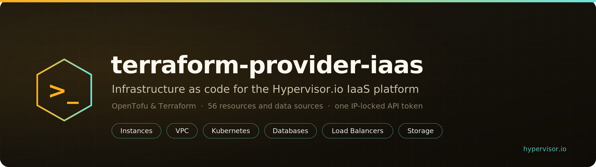

<p align="center">
  
</p>

# terraform-provider-iaas

A Terraform / OpenTofu provider for managing virtual machine infrastructure - compute,
networking, storage, databases, S3, Kubernetes, and operational policies - as
Infrastructure-as-Code over the IaaS platform's **user** REST API.

## Authentication - IP-locked Bearer token (read this first)

> **The central constraint.** This provider authenticates with a **Bearer API token that is
> validated against the egress IP address it was registered with.** Requests from any other
> source IP are rejected (HTTP 401/403). You **must** run `tofu` / `terraform` from the same
> static IP the token is registered against - a **static CI runner, bastion host, or
> workstation**. **Dynamic-IP CI environments (most hosted runners) are not supported** and
> will fail authentication. The token may also be scoped to a **subuser** with a limited set
> of permissions, in which case operations outside that scope return 403.

Set the two required values via environment variables (preferred - avoids hardcoding the token):

```sh
export IAAS_API_ENDPOINT="https://panel.example.com/api"   # base URL, including the /api suffix
export IAAS_API_TOKEN="your-ip-locked-token"
tofu apply
```

| Variable             | Maps to provider attr | Description                                              |
|----------------------|-----------------------|----------------------------------------------------------|
| `IAAS_API_ENDPOINT`  | `endpoint`            | Base API URL including the `/api` path suffix            |
| `IAAS_API_TOKEN`     | `token`               | Bearer token (IP-locked - see above)                     |

## Provider configuration

```hcl
provider "iaas" {
  endpoint        = "https://panel.example.com/api" # or IAAS_API_ENDPOINT
  token           = var.iaas_token                  # or IAAS_API_TOKEN (sensitive - prefer the env var)
  request_timeout = 30                              # optional, HTTP timeout in seconds (default 30)
  insecure        = false                           # optional, skip TLS verification (staging only)
}
```

| Attribute         | Env var              | Required | Default | Description                                                       |
|-------------------|----------------------|----------|---------|-------------------------------------------------------------------|
| `endpoint`        | `IAAS_API_ENDPOINT`  | yes      | -       | Base API URL including the `/api` path suffix                     |
| `token`           | `IAAS_API_TOKEN`     | yes      | -       | Bearer token (IP-locked - see Authentication above). Sensitive.   |
| `request_timeout` | -                    | no       | `30`    | HTTP request timeout in seconds                                   |
| `insecure`        | -                    | no       | `false` | Skip TLS certificate verification - staging only, never production |

Either the attribute or its environment variable must be set for `endpoint` and `token`; the
environment variable is used as a fallback when the attribute is unset.

## Coverage

The provider ships **35 resources** and **10 data sources**, grouped by area below. Every name
listed here is registered in [`internal/provider/provider.go`](internal/provider/provider.go).

### Compute / instances

- `iaas_instance` - virtual machine lifecycle (deploy, power, reinstall, destroy; async-converged)
- `iaas_ssh_key` - SSH public keys for instance provisioning
- `iaas_project` - project grouping for resource organization

### Networking - VPC, IP, security, NAT, load balancing, VPN, DNS

- `iaas_vpc` - virtual private cloud
- `iaas_vpc_subnet` - subnet within a VPC
- `iaas_static_ip` - reserved/static IP allocation
- `iaas_ip_set` - named IP set (with entries) for firewall references
- `iaas_security_group` - security group with rules and instance attachments
- `iaas_nat_gateway` - NAT gateway
- `iaas_load_balancer` - load balancer
- `iaas_lb_backend` - load balancer backend pool
- `iaas_lb_target` - backend target (instance/IP + port)
- `iaas_lb_frontend` - frontend listener
- `iaas_lb_routing_rule` - routing rule
- `iaas_lb_certificate` - TLS certificate for a frontend
- `iaas_vpn_gateway` - VPN gateway
- `iaas_vpn_peer` - VPN peer (child of a gateway)
- `iaas_dns_zone` - DNS zone
- `iaas_dns_record_set` - DNS record set
- `iaas_dns_record` - individual DNS record (with optional inline health check)

### Storage - volumes, snapshots, S3

- `iaas_volume` - block storage volume
- `iaas_volume_snapshot` - volume snapshot
- `iaas_s3_bucket` - S3-compatible object storage bucket
- `iaas_s3_access_key` - S3 access key

### Data - managed databases

- `iaas_managed_database` - managed database instance
- `iaas_db_replica` - read replica (child of a managed database)
- `iaas_db_parameter_group` - database parameter group

### Operations - backups, notifications, alerting, autoscaling

- `iaas_instance_backup_policy` - instance backup schedule/policy
- `iaas_db_backup_policy` - managed-database backup policy
- `iaas_notification_channel` - notification delivery channel
- `iaas_alert_rule` - alerting rule
- `iaas_autoscaling_group` - autoscaling group
- `iaas_autoscaling_policy` - autoscaling policy (child of a group)

### Kubernetes

- `iaas_kubernetes_cluster` - managed Kubernetes cluster (multi-stage async)
- `iaas_kubernetes_node_pool` - node pool (manages the default pool too, via import)

### Data sources

**Instance catalog lookups:**

- `iaas_location` - region/location lookup
- `iaas_plan` - instance plan lookup
- `iaas_image` - OS image lookup
- `iaas_iso` - ISO lookup

**VPN:**

- `iaas_vpn_peer_config` - downloadable peer configuration

**Kubernetes:**

- `iaas_kubernetes_kubeconfig` - admin kubeconfig (Computed, **Sensitive**; re-read rotates the cert)
- `iaas_kubernetes_autoscaler_manifest` - cluster-autoscaler manifest (Computed, **Sensitive**; embeds a JWT)
- `iaas_kubernetes_version` - Kubernetes version catalog lookup
- `iaas_kubernetes_region` - Kubernetes region catalog lookup
- `iaas_kubernetes_plan` - Kubernetes plan catalog lookup (`kind` = `worker` | `cp` | `lb`)

## Not in v1 (intentionally excluded)

The following are **deliberately not provided** as resources, because they are a poor fit for
declarative Infrastructure-as-Code:

- **`iaas_api_token`** - managing the very token the provider authenticates with creates a
  chicken-and-egg bootstrap problem, and tokens are **IP-locked**, so a token created by one
  apply would not be usable from a different egress IP. Create API tokens **manually in the
  control panel** (register them against the static IP you will run Terraform/OpenTofu from).
- **Team `iaas_role` / `iaas_subuser`** - team/permission administration is an account-governance
  concern, not infrastructure. Create **roles and subusers manually in the control panel**, then
  issue an IP-locked, scoped token to the subuser for use with this provider.

## Acceptance testing

Acceptance tests (`TF_ACC`) exercise the real API and are a **manual gate only** - they require a
**static-IP host** and a valid **IP-locked token**, so they are **not run in CI** (CI has no live
panel and no registered egress IP). Unit tests and mock-backed lifecycle tests run in CI; the
acceptance suite is run by hand against staging:

```sh
export TF_ACC=1
export IAAS_API_ENDPOINT="https://staging.example.com/api"
export IAAS_API_TOKEN="ip-locked-staging-token"   # registered to this host's IP
go test ./... -count=1   # add -run TestAcc... to scope
```

## Development

```sh
make build   # builds the terraform-provider-iaas binary
make test    # go test ./...
make vet     # go vet ./...
make fmt     # gofmt -w .
make tools   # install tfplugindocs (doc generator)
make docs    # regenerate reference docs under docs/
```

Reference docs are generated via
[tfplugindocs](https://github.com/hashicorp/terraform-plugin-docs) and committed under `docs/`
so they can be published to the Terraform / OpenTofu Registry. CI fails if `docs/` drifts from a
fresh `make docs`.

### Local testing with a dev override

A dev override lets `tofu` use a locally built binary without installing it from a registry:

```sh
make build   # produces ./terraform-provider-iaas

cat > /tmp/iaas-dev.tfrc <<EOF
provider_installation {
  dev_overrides { "iaas/iaas" = "$(pwd)" }
  direct {}
}
EOF

export TF_CLI_CONFIG_FILE=/tmp/iaas-dev.tfrc
# A dev override short-circuits `tofu init` - validate/plan directly.
cd examples/stacks/web-app && tofu validate
```

### Releasing

Releases are produced by [GoReleaser](https://goreleaser.com) (see `.goreleaser.yml`) and
published to the registry by the `Release` workflow when a `v*` tag is pushed. To dry-run the
release build locally (requires `goreleaser` on PATH):

```sh
make release-snapshot   # goreleaser release --snapshot --clean
```

## License

See [LICENSE](LICENSE).
